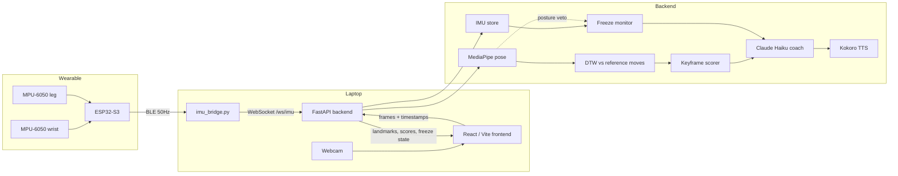

# Breakdown: Real-Time AI Breakdance Coaching

Breakdown watches you dance through a webcam, reads motion from sensors worn on your body, and coaches you in real time. It compares your movement against reference moves, grades your freezes by how steady you hold them, and speaks short coaching cues generated by Claude.

It started as a personal problem. Practicing alone means nobody tells you if your form is actually improving or just feels right. It's also built for beginners who want to learn but aren't ready to dance where everyone's watching.

<!-- Demo: add a short clip here, e.g.  -->

---

## What it does

- **Tracks 33 body landmarks** from your webcam with MediaPipe
- **Compares your movement to reference moves** with Dynamic Time Warping, so doing a move slower or faster than the reference still lines up
- **Scores keyframes** by joint angle, with per-joint feedback and a combo system
- **Grades freezes with wearable IMUs:** hold time, a 0 to 100 stability score, and which limb wobbled most
- **Coaches out loud:** Claude Haiku turns the measured data into short cues, spoken locally with Kokoro TTS
- **Fuses camera and sensors:** the IMUs cover what the camera can't see well (inversions, overlapping limbs), and the camera rules out false freezes

---

## Architecture



---

## How it works

### Camera pipeline

The browser captures webcam frames and sends them to the backend over a WebSocket. MediaPipe extracts 33 landmarks per frame. Landmarks are normalized to a hip-centered origin and scaled by hip width, so comparisons don't depend on body size or distance from the camera. Frames go into a 60-frame sliding window that's compared against reference moves with DTW in a background thread, so the comparison never blocks frame processing.

### Wearable pipeline

Two MPU-6050 IMUs (wrist and leg) sit on separate I2C buses of an ESP32-S3. The firmware samples both at 50Hz and sends 32-byte binary packets over Bluetooth Low Energy. A Python bridge on the laptop receives them, stamps each with the laptop's clock, and forwards them to the backend.

### Lining the two up

The bridge, the backend, and the browser all run on the same laptop, so they read the same system clock. Camera frames carry their capture time, IMU packets carry their arrival time, and the backend matches each frame to the nearest IMU sample by timestamp.

### Freeze detection

A freeze is a still hold that follows real movement. The IMUs decide when you're holding and how steady you are. The camera can veto a hold if it clearly saw your torso upright, since that's a standing pause, not a freeze.

---

## Engineering decisions

**Backpressure on the camera stream.** Frames were originally sent on a fixed timer whether or not the backend was done with the last one. Frames queued up, and lag grew the longer you danced. The frontend now sends a new frame only after the previous one is answered, and skips frames while the backend is busy, so the backend always works on the freshest frame. Frames are also downscaled before sending, and a round-trip latency readout in debug mode measures the result.

**Binary packets over BLE.** Each sample is 32 bytes. The same data as JSON would be several times larger, and BLE bandwidth is limited. Every packet carries a sequence number, so the bridge can count dropped packets, including correctly handling the 16-bit counter wrapping from 65535 to 0.

**Bounded queues that drop old data.** If the backend is down, the bridge throws away its oldest packets instead of letting them pile up. For live coaching, only fresh data matters. It's the same idea as the camera backpressure, applied to the sensor stream.

**Measuring wobble as spread, not magnitude.** Every gyro reads a small constant offset even when perfectly still. Stability is scored from the standard deviation of the readings, which ignores a constant offset entirely, so no calibration step is needed. The first and last quarter second of each hold are also skipped when scoring, so settling into a freeze isn't graded as wobble.

**The camera only vetoes when it can see.** Real freezes often hide the torso from the camera, which is the whole reason the IMUs exist. So a blind camera never blocks a freeze. Only a camera that clearly saw you standing can.

**Grounded coaching.** The coach prompt only contains values the system actually measured (hold time, stability, shakiest limb, joint angles), so cues can't claim things the data doesn't support.

### Measured

- IMU stream: steady 50 packets/s with 0 dropped packets
- Frame-to-IMU alignment: within one sample interval (about ±20ms at 50Hz)

---

## Hardware

| Part | Notes |
|---|---|
| ESP32-S3 dev board (N16R8) | Reads both IMUs, streams over BLE |
| 2x MPU-6050 (GY-521 boards) | Gyro ±2000°/s and accel ±8g, sized for spins and landings |
| Jumper wires | Each IMU on its own I2C bus |
| USB power bank | Powers the board while dancing |

| MPU-6050 pin | Wrist sensor | Leg sensor |
|---|---|---|
| VCC | 3V3 | 3V3 |
| GND | GND | GND |
| SDA | GPIO 8 | GPIO 5 |
| SCL | GPIO 9 | GPIO 6 |

Flashing and hardware tests are in [`firmware/README.md`](firmware/README.md).

---

## Running it

Requires Python 3.12 and Node.js 20+.

### 1. Backend

```bash
cd backend
python3 -m venv .venv
source .venv/bin/activate
python -m pip install -r requirements.txt
python -m uvicorn api.server:app --reload --port 8000
```

### 2. Frontend

```bash
cd frontend
npm install
npm run dev
```

Open http://localhost:5173.

### 3. AI coach and voice (optional)

Create a `.env` file in the repo root:

```
ANTHROPIC_API_KEY=your_key_here
```

For spoken cues, download the Kokoro model files into `backend/`:

```bash
cd backend
curl -L -o kokoro-v1.0.onnx https://github.com/thewh1teagle/kokoro-onnx/releases/download/model-files-v1.0/kokoro-v1.0.onnx
curl -L -o voices-v1.0.bin https://github.com/thewh1teagle/kokoro-onnx/releases/download/model-files-v1.0/voices-v1.0.bin
```

The app runs without either. Coaching and voice just switch off.

### 4. Wearable sensors (optional)

Flash the firmware (see [`firmware/README.md`](firmware/README.md)), power the board, then in a new terminal:

```bash
cd backend
source .venv/bin/activate
python -m pip install -r requirements-bridge.txt
python scripts/imu_bridge.py --forward
```

The bridge prints packet rate, drops, and sensor status every second. In the app, turn on **Debug** to see round-trip latency, IMU status, frame alignment, and what the freeze detector is doing.

### Recording and replaying sensor data

```bash
python scripts/imu_bridge.py --record 60
python scripts/analyze_recording.py recordings/imu_<date>.csv
```

Recording saves a session to CSV. The analyzer replays it through the freeze detector, which makes it possible to tune thresholds against real dancing without wearing the hardware each time.

---

## Tests

```bash
pytest backend/tests -v
```

Tests cover the DTW engine, scoring, the pose buffer, IMU packet decoding and drop counting, timestamp alignment, freeze detection and stability scoring, the camera posture veto, and coach prompts. The IMU tests use synthetic data, so no hardware is needed. CI runs the suite on every pull request.

---

## Project structure

```
backend/
  api/server.py          FastAPI app: session WebSocket, IMU WebSocket, status endpoints
  app/
    pose_estimator.py    MediaPipe wrapper and landmark normalization
    buffer.py            60-frame sliding window
    dtw_engine.py        Async DTW comparison against reference moves
    scorer.py            Keyframe scoring and combos
    coach.py             Claude Haiku coaching cues
    voice.py             Kokoro text-to-speech
    imu_protocol.py      Decodes firmware packets
    imu_store.py         Thread-safe rolling buffer of IMU samples
    imu_metrics.py       Freeze detection and stability scoring
    posture.py           Torso angle from camera landmarks
    freeze_monitor.py    Fuses IMU and camera for live freeze tracking
  scripts/
    imu_bridge.py        BLE to backend bridge, with recording
    analyze_recording.py Replays recordings through the freeze detector
    convert_aist.py      Converts AIST++ dance data into reference moves
  reference_moves/       Reference sequences (.npy) and metadata
  tests/
frontend/                React + Vite
firmware/imu_ble/        ESP32-S3 firmware (Arduino)
```

---

## Roadmap

- [ ] Detect when a sensor isn't on the body, by comparing IMU motion to the camera's view of that limb
- [ ] Spin speed and landing impact from IMU data
- [ ] Fill in occluded limbs on the skeleton using IMU orientation
- [ ] Session summary and history
- [ ] 3D-printed TPU enclosure for the wearable
- [ ] Mobile app that connects to the sensors directly

---

## License

MIT
